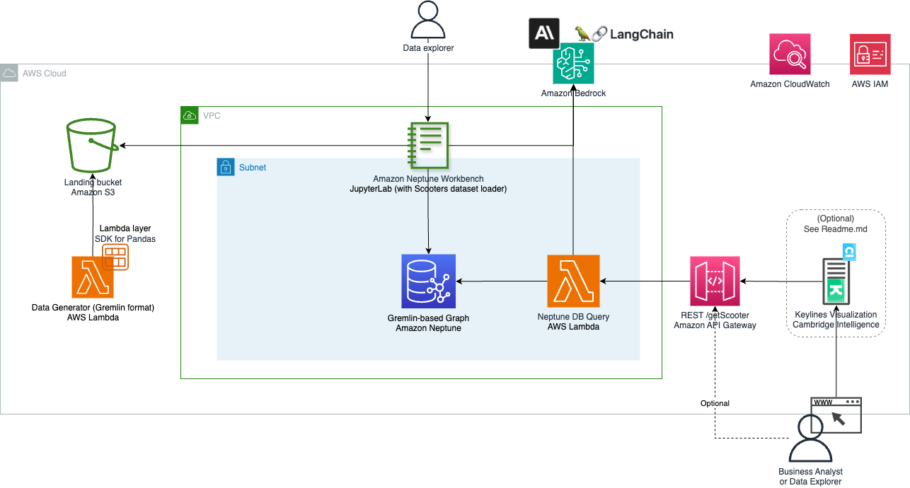
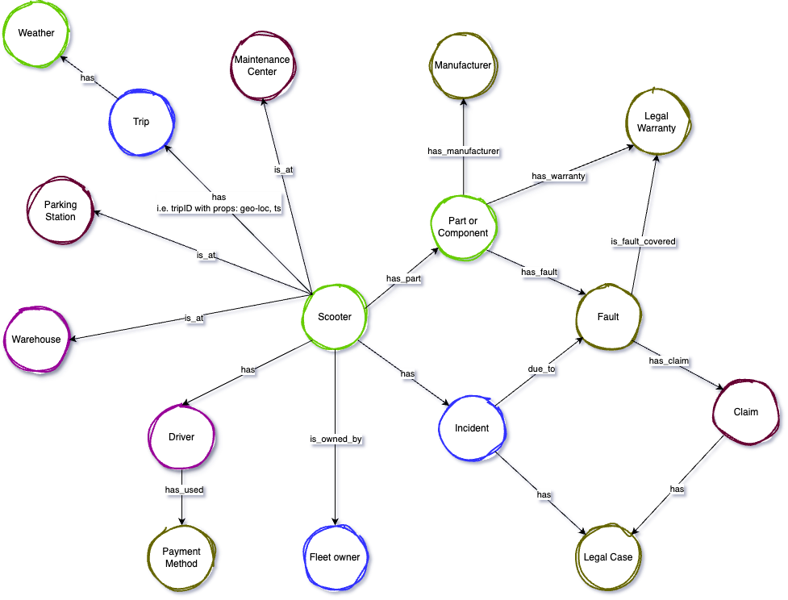

# Welcome to the Amazon Neptune Scooters demo!

Welcome to our tutorial "Implementing a Graph database for a Scooters Business on AWS". Throughout this session, we'll delve into the fascinating realm of Graph Databases and Generative AI oriented to Graphs, and sometimes comparing these technologies with traditional relational systems or RDBMS. Given the widespread use and understanding of RDBMS, we believe comparing these two systems will provide a clearer perspective for those trying to grasp the concepts of graph databases.

## 📋 Table of content

- [Description](#-description)
- [Use cases](#-use-cases)
- [Pre-requisites](#-pre-requisites)
- [Installing](#-installing)
- [Architecture](#-architecture)
- [Cleanup](#-cleanup)

## 🔰 Description

By the end of this tutorial, you will:

* Understand the fundamentals of Graph Databases; i.e. main differences between graph and relational DBs.
* Gain insights into the unique advantages and challenges, offered by graph databases.
* Learn about Amazon Neptune service, tailored for graph database deployments.
* Learn how to use Generative AI, to help you in coding and abstracting Gremlin query language with natural language.
* Have your own customisable Graph Data Generator.
* Appreciate scenarios, where graph databases outshine their relational counterparts.
* Get hands-on experience, with setting up, loading and querying a graph database on AWS.
* Build most of the tutorial using Infrastructure-as-Code (IaC) Amazon CDK
* For those with relational databases experience, this exploration will illuminate new possibilities and data solutions. For newcomers, you're about to dive into a dynamic way of visualizing and interpreting data. 

## 🛠 Use cases

- Comparison of technology applicability: <i>"use the right tool for the right job"</i>.
- Analysis of Performance and TCO; i.e. Relational Database vs. Graph Database.
- Deploy a Graph Data Generator, completely customizable for any use case to build.
- Understand how to use a [Large Language Model](https://aws.amazon.com/what-is/large-language-model/), to interrogate Graph database.

## 🎒 Pre-requisites

- [Docker](https://www.docker.com/): Install and run Docker locally. This tool uses docker to build image and run containers.
- Minimum disk space of 2 GB for building and deploying docker image
- Install [AWS CLI](https://docs.aws.amazon.com/cli/latest/userguide/getting-started-install.html)
- Install Python 3.9+ 
- Install [Node.js](https://nodejs.org/en/)
- After installing Node.js (```npm``` in path), install [Amazon CDK](https://docs.aws.amazon.com/cdk/v2/guide/getting_started.html); e.g. ```npm install -g aws-cdk```
- Install Visual Studio Code, with Amazon Code [Whisperer Plugin](https://youtu.be/rHNMfOK8pWI)

## 🚀 Installing

This project is set up like a standard Python project.  The initialization
process also creates a virtualenv within this project, stored under the `.venv`
directory.  To create the virtualenv it assumes that there is a `python3`
(or `python` for Windows) executable in your path with access to the `venv`
package. If for any reason the automatic creation of the virtualenv fails,
you can create the virtualenv manually.

To manually create a virtualenv on MacOS and Linux:

```
$ python3 -m venv .venv
```

After the init process completes and the virtualenv is created, you can use the following
step to activate your virtualenv.

```
$ source .venv/bin/activate
```

If you are a Windows platform, you would activate the virtualenv like this:

```
% .venv\Scripts\activate.bat
```

Once the virtualenv is activated, you can install the required dependencies. Optionally use ```--upgrade```

```
$ pip install -r requirements.txt
```

Add/change your own environment to the cdk.json file, at the 'context' key. For example, if you want to add your 'Production' environment:
```json
...
"context": {
"environments": {
  "production": {
    "vpc_neptune": "",
    "s3_prefix_scooters_data_loc":"scooters-graph-demo/neptune/data",
    "lambda_datagen_num_vehicles":"1000",
    "lambda_datagen_num_parts":"10",
    "api_gtw_ip_addr_whitelist_list":""
  }
},
...
}
```

⚠️ Important: to create a safer deployment for this demo, you need to add/leave one environment (i.e. even if the optional keys have empty values, like the ones above):

- <b>vpc_neptune</b> [optional]: if you want to deploy all the assets in your VPC, instead of creating a new one, you can change it here.
- <b>s3_prefix_scooters_data_loc</b>: to change the path (S3 Key), after the new S3 bucket name.
- <b>lambda_datagen_num_vehicles</b>: number of scooters (graph nodes) to create in the dataset
- <b>lambda_datagen_num_parts</b>: number of parts (graph nodes) to add per scooter.
- <b>api_gtw_ip_addr_whitelist_list</b> [optional]: list of IPs or CIDR to be whitelisted in the API Gateway.


You can now synthesize your CDK stacks:

💡 Tips: 
- Remember to have Docker running at this point! 
- If you received an error like —app is required..., it's probably because you are running the command from a subdirectory. Navigate to the main app directory and try again.

If this is your first time using Amazon CDK in this account, we need to bootstrap it first:

```
$ cdk bootstrap --profile profile-aws-dev-sandbox
```

Synthesize all your stacks:

```
$ cdk synth --all --profile profile-aws-dev-sandbox
```

If the previous steps succeeded, then we can deploy our entire project:

💡 Tip: this deployment can take more than 15 minutes, especially if it's the first time.

```
$ cdk deploy --all --profile profile-aws-dev-sandbox
```

If you don't want to be asked by CDK:
```
$ cdk deploy --profile profile-aws-dev-sandbox --require-approval never --all
```

Once you have deployed the Amazon CDK project successfully, you can carry on with the steps provided in the blog post and YouTube video series.

#### Useful commands

 * `cdk ls`          list all stacks in the app
 * `cdk synth`       emits the synthesized CloudFormation template
 * `cdk deploy`      deploy this stack to your default AWS account/region
 * `cdk diff`        compare deployed stack with current state
 * `cdk docs`        open CDK documentation

## Architecture



### Adapt the graph to your own use case
The graph data model uses Any Python Tree Data, to deploy the Vehicle hierarchy. You can modify this hierarchy graph model via the Lambda function, within the Data Generation stack.

### Data model



## Cleanup
1. Via AWS CLI or the AWS console, empty the S3 bucket created by our CDK stack; e.g. s3://scooterss3stack-scootersdemoXXXX/. Otherwise, our CDK Removal Policy will not be able to delete the bucket.
2. Run the command below, to delete all resources deployed by our CDK project (architecture image above). This will ask if you want to delete those stacks; enter Y.
```
$ cdk destroy --all --profile profile-aws-dev-sandbox
```
