# AWS Developers: Build a graph in Amazon Neptune with CDK & Generative AI

Note: while this tutorial provides a step-by-step to deploy this project, it doesn’t provide detailed explanations about each section. For that, we highly recommend to visit our [YouTube Tutorial](https://www.youtube.com/playlist?list=PL5bUlblGfe0I3HWMIj6EWG7bVIMbQJE9l), from our [YouTube AWS Developers channel](https://www.youtube.com/@awsdevelopers/playlists), and look for this same tutorial in video format.

## Introduction

In today's data-driven world, the way we store, query, and interact with data is evolving. As the complexity and interconnectivity of our data increase, traditional storage methods such as Relational Database Management Systems (RDBMS) face new challenges. This is where graph databases emerge, as a powerful approach to handle highly interconnected data. In addition, with the emerge of Generative AI, there's a new need that relies on simplifying complex methods to query data stores, like using natural language instead of database languages.   

Welcome to our tutorial on "Implementing a Graph database for a Scooters Business on AWS". Throughout this session, we'll delve into the fascinating realm of Graph Databases and Generative AI oriented to Graphs, and sometimes comparing these technologies with traditional relational systems or RDBMS. Given the widespread use and understanding of RDBMS, we believe comparing these two systems will provide a clearer perspective for those trying to grasp the concepts of graph databases.

By the end of this tutorial, you will:

* Understand the fundamentals of Graph Databases; i.e. main differences between graph and relational DBs.
* Gain insights into the unique advantages (and challenges) offered by graph databases.
* Learn about Amazon Neptune service, tailored for graph database deployments.
* Learn how to use Generative AI to help you in coding and abstracting Gremlin query language with natural language.
* Have your own customisable Graph Data Generator.
* Appreciate scenarios where graph databases outshine their relational counterparts.
* Get hands-on experience, with setting up, loading and querying a graph database on AWS.
* Build most of the tutorial using Infrastructure-as-Code (IaC) Amazon CDK
* For those with relational databases experience, this exploration will illuminate new possibilities and data solutions. For newcomers, you're about to dive into a dynamic way of visualizing and interpreting data. 

## Getting started with the existing code

1. Let’s clone the Amazon CDK project we have developed for this series. 

```
git clone https://github.com/build-on-aws/building-a-graph-database-for-scooters -b build-on-aws-tutorial
```

Make sure the following software is installed on your local environment:

* Install AWS CLI @ URL: https://docs.aws.amazon.com/cli/latest/userguide/getting-started-install.html
* Install Python 3.9+ 
* Install and run Docker @ URL https://docs.docker.com/get-docker/ 
* Install Node.js @ URL https://nodejs.org/en/
* Install Amazon CDK: `npm install -g aws-cdk `
* Install Visual Studio Code with Amazon Code Whisperer Plugin @ [https://youtu.be/rHNMfOK8pWI](https://youtu.be/rHNMfOK8pWI?feature=shared)

2. Open the cloned project from the previous step, from your preferred IDE. We’ll be using Visual Studio Code.

Note: if you don’t have any preferred IDE, you can download Visual Studio Code for free from https://visualstudio.microsoft.com/vs/community/.

Once you open the cloned project, start a new terminal in VS code, to create a virtual environment. Make sure your terminal session is at the root directory from our project; e.g.

```
❯ tree -L 1 .
.
├── README.md
├── app.py
├── cdk.context.json
├── cdk.json
├── cdk.out
├── neptune_datasets
├── neptune_notebooks
├── package-lock.json
├── package.json
├── requirements-dev.txt
├── requirements.txt
├── source.bat
├── stack_lambda_datagen
├── stack_params_config
├── stack_s3
├── stack_vpc_neptune
└── tests
```

3. Create a virtual environment, to install our dependencies:

```
# Create it
python3 -m venv .venv

# Load it.  VS Code will ask you which Python executable (use the latest version):
source .venv/bin/activate

# Make sure the linked-executable python uses to the correct version
python3 -V # this should be 3.8 or higher)

# Install project dependencies
python3 -m pip install -r requirements.txt
```

**Project Parameters:**
When you use Amazon CDK in Python, the entry point for your CDK project is called app.py. From here, we call our Context file “cdk.json” using try_get_context to fetch the following parameters:

```
  "context": {
    "environments": {
      "production": {
        "vpc_neptune": "",
        "s3_prefix_scooters_data_loc":"scooters-graph-demo/neptune/data",
        "lambda_datagen_num_vehicles":"1000",
        "lambda_datagen_num_parts":"10",
        "api_gtw_ip_addr_whitelist_list":""
      }
    }
```


⚠️ Important: to create a safer deployment for this demo, you need to add/leave one environment (i.e. even if the optional keys have empty values, like the ones above):

* **vpc_neptune** [optional]: if you want to deploy all the assets in your VPC, instead of creating a new one, you can change it here.
* **s3_prefix_scooters_data_loc**: to change the path (S3 Key), after the new S3 bucket name.
* **lambda_datagen_num_vehicles**: number of scooters (graph nodes) to create in the dataset
* **lambda_datagen_num_parts**: number of parts (graph nodes) to add per scooter.
* **api_gtw_ip_addr_whitelist_list** [optional]: list of IPs or CIDR to be whitelisted in the API Gateway.


**AWS account and region modifications**: this project will take your AWS CLI profile settings, for your account id and region. If you need to change these, you can overwrite these in the `app.py → env_aws_settings`, or you can also add these to `cdk.json` file too. 

**Permissions example**: if you’re planning to deploy this project on your account id “123456789012” (account name “aws-dev-sandbox”) and you’re planning to use your [AWS CLI profile](https://docs.aws.amazon.com/cli/latest/userguide/cli-configure-files.html) called “profile-aws-dev-sandbox”, then the IAM credentials stored for this profile should have enough privileges to perform all actions; i.e. IAM writing and reading actions to create or grant roles. We suggest using a CLI profile with Administrator Access on such account or use a similar custom admin role and deploy the CDK stacks using the option `--role-arn (or -r) ` 

**Optional changes**: change the values of the rest of the parameters; for example, if you want a different path (prefix) in the S3 bucket that CDK will create or if you want to generate more data (e.g. 10,000 scooters). Bear in mind this demo is not intended to create large volumes of data. The VPC parameter allows you to reuse an existing VPC, so you just need to provide the `vpc-id`. Consider the network subnets (e.g. CIDR ranges) and, if you want to view/change these, open the  stack called `ScootersNeptuneStack (file vpc_neptune_stack).`

**Best practice note:**

You can migrate this cdk.json parameters to something less hard-coded and more maintainable, if you want to reuse this project for your real development environment. Imagine if you change any of these parameters, and anyone in the team wants to see which values were used for the deployment X last week.  

You can move this dictionary to the Parameter Store in Systems Manager. This service allows you to overwrite the parameter values, keeping an internal [versioning record](https://docs.aws.amazon.com/systems-manager/latest/userguide/sysman-paramstore-versions.html); in fact, we have prepared the `ScootersSsmParametersStack` CDK stack with some examples, so you can see how easy is to store these parameters in Systems Manager and then pull these from the different CDK stacks, using something like:  `ssm.StringParameter.value_from_lookup`.

As you can see, the `app.py` file contains all the CDK stacks we’ll be deploying during this series, but we’ll let’s go step by step, to explain what this code does.

## Generative AI Model access

Part of this lab, included in the Jupyter Sagemaker notebook below, will include some activities with Amazon Bedrock and the Anthropic Claude model. This section is optional, but if you want to do it, please grant Amazon Bedrock to access Anthropic Claude ([full instructions here](https://docs.aws.amazon.com/bedrock/latest/userguide/model-access.html)) model first, in the region you are working.

## Deploying our Scooters CDK Project

What is Amazon CDK: The AWS Cloud Development Kit (AWS CDK) is an open-source software development framework for defining cloud infrastructure as code, with modern programming languages and deploying it through AWS CloudFormation. More at [aws.amazon.com/cdk](https://aws.amazon.com/cdk/)

**Important**: We recommend to deploy this CDK project in an isolated environment, to avoid impact other teams or systems in your company. For example, this project will create a VPC with network subnet CIDR ranges, which could affect your corporation’s network. You can always change the CIDR or other details, in the stack called `ScootersNeptuneStack (file vpc_neptune_stack).`

Let’s go step by step, to deploy our CDK Project, which will create a full architecture for our Scooters graph use case. First, don’t forget to open your VS Code IDE, open our project’s folder and open a terminal (from VS code).

1. From the VS Code terminal, make sure your AWS CLI is working. For example, list your buckets using your default profile or the one you’ll use to deploy this CDK project

```
# Using default's CLI profile
aws s3 ls s3://some_existing_bucket/

# Using default's CLI profile
aws s3 ls --profile profile-aws-dev-sandbox 
```

For the rest of the CDK commands, we’ll be using the profile option. If you’re using your default’s profile, you can ignore this command option; e.g. `cdk ls`

>>> **Important!** Make sure Docker Desktop is running on your computer. Otherwise the following steps will fail.

2. Once you make sure the CLI works and list your buckets, we can now list the CDK Stacks included in this project

**Important**: only use supported regions for [Amazon Bedrock](https://docs.aws.amazon.com/bedrock/latest/userguide/what-is-bedrock.html#bedrock-regions). By default, Oregon (us-west-2) is preset.

```
# Make sure you'll always run this from our root project
cdk ls --profile profile-aws-dev-sandbox

# Results
ScootersSsmParametersStack
ScootersS3Stack
ScootersDataStack
ScootersNeptuneStack
```

3. Bootstrap the target AWS account:

```
cdk bootstrap --profile profile-aws-dev-sandbox
```

Note: *Bootstrapping* is the process of provisioning resources for the AWS CDK before you can deploy AWS CDK apps into an AWS [environment](https://docs.aws.amazon.com/cdk/v2/guide/environments.html). (An AWS environment is a combination of an AWS account and Region). These resources include an Amazon S3 bucket for storing files and IAM roles that grant permissions needed to perform deployments. The required resources are defined in an AWS CloudFormation stack, called the *bootstrap stack*, which is usually named `CDKToolkit`. Like any AWS CloudFormation stack, it appears in the AWS CloudFormation console once it has been deployed.
More at: [docs.aws.amazon.com/cdk/v2/guide/bootstrapping.html](https://docs.aws.amazon.com/cdk/v2/guide/bootstrapping.html)


4. Let’s make sure everything is ready to deploy, by synthesizing our CDK Project

The cdk synth command executes your app, which causes the resources defined in it to be translated into an AWS CloudFormation template. The displayed output of cdk synth is a YAML-format template. This also catches logical errors in defining your AWS resources.

Note: this can take a couple of minutes to run the first time.

```
cdk synth --all --profile profile-aws-dev-sandbox
```

Tip: If you received an error like —app is required..., it's probably because you are running the command from a subdirectory. Navigate to the main app directory and try again.

The cdk synth step should have returned with no errors. For example, with a message similar to this:

```
...
#6 exporting to image
#6 exporting layers done
#6 writing image sha256:8f15123dc645645644a516b7b89f08f29a6e8fe21e9291 done
#6 naming to docker.io/library/cdk-ad046f954564d3e28194f60e81f1d9d4804e7d40825 done
#6 DONE 0.0s

What is Next?
  View summary of image vulnerabilities and recommendations → docker scout quickview

Successfully synthesized to /.../building-a-graph-database-for-scooters/cdk.out
Supply a stack id (ScootersSsmParametersStack, ScootersS3Stack, ScootersDataStack, ScootersNeptuneStack) to display its template. 
```

5. Building time! Let’s finally run our CDK project. This will deploy all stacks in our entry point `app.py` or what we saw in the `cdk ls` command, building the architecture below.

Tip: the deploy command will ask a few times if you approve the IAM permissions to be deployed by this stack. You simply need to enter Y to continue. However, if you want to leave the entire command unattended, you can use the flag `--require-approval never`

```
cdk deploy --all --profile profile-aws-dev-sandbox
```

Image below: architecture deployed by our CDK project:

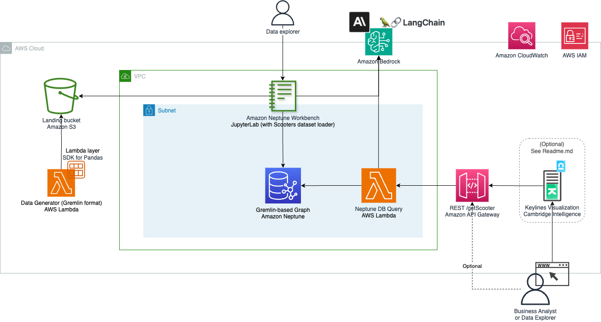

Note: the deployment of all the CDK stacks takes 10 to 15 minutes. 

Once all the stacks are deployed, you should see a success message like the following:

```
ScootersNeptuneStack: deploying... [4/4]
ScootersNeptuneStack: creating CloudFormation changeset...

 ✅  ScootersNeptuneStack

✨  Deployment time: 822.89s

Outputs:
ScootersNeptuneStack.apiquerydbEndpointE55EE8CE = https://daerbgy1f3.execute-api.eu-west-1.amazonaws.com/prod/
ScootersNeptuneStack.outputneptuneendpoint = neptunedbcluster-abcdefdihdbi.cluster-xyzs8psrpx2f.eu-west-1.neptune.amazonaws.com
ScootersNeptuneStack.outputneptuneiamrole = arn:aws:iam::12345679012:role/ScootersNeptuneStack-scootersneptuneroleABC3CCC3-XYZY5HFAWHFE
ScootersNeptuneStack.outputs3bucket = scooterss3stack-scootersdemo5e399941-17bmwewec2uso
Stack ARN:
arn:aws:cloudformation:eu-west-1:12345679012:stack/ScootersNeptuneStack/123e4930-aabb-ccee-8c1e-06abd49c9fd7

✨  Total time: 829.41s
```

Note: It is not required, but you can copy the output from the CDK’s deployment or simply don’t close this Terminal, as we’ll need those Output values later. Don’t worry if you close it, as this information is also stored on CloudFormation. Therefore, we can get this information by querying this service via the AWS CLI or directly in the AWS CloudFormation console. 

## Quick Intro to Graph Databases

Graph databases might be different than databases you have used in the past, such as relational databases. There are a few key terms to know about graph databases:

* Graph: This refers to the database as a whole. It is similar to a table in other databases.
* Vertex: A vertex (also called a *node*) represents an item in the graph. It is generally used to represent nouns or concepts such as people, places, and terms. The plural of vertex is *vertices*, a term that is used in this lesson.
* Edge: A connection between two vertices. Edges often represent relationships between entities. For example, two people who work together might be connected by a WorksWith edge.
* Label: Can be used to indicate the type of vertex or edge being added. For example, you might have vertices with the label User to indicate users in your application, as well as vertices with the label Interest to indicate an interest that people can follow.
* Property: You can add key-value pairs to your vertices and edges. These are known as *properties*. For example, your user vertices have a username property.

When querying a graph, you often start at a vertex and traverse the edges to find relationships to that original vertex. In your fraud-detection use case, you might start with a User vertex and traverse the Reviewed edges to find the Restaurant vertices that the user has reviewed.

When building your graph data model, you should think about the entities in your application and how they relate to each other. The information that you model in your graph database may be different than what you store in your primary data store.

For example, your primary database might include information about the date of birth for each of your users. Though you might want to use that in your primary database for actions such as sending your users special offers on their birthdays, it's unlikely to be useful in the fraud-detection service. Because date of birth is unlikely to affect fraud, you can leave it out of that database entirely.

Chapter source: [aws.amazon.com/tutorials/purpose-built-databases/neptune/](https://aws.amazon.com/tutorials/purpose-built-databases/neptune/) 

## Understanding Graph data in Amazon Neptune

As you may have seen in the CDK stacks, we have created a simple way to create a randomized graph dataset, for our Scooters use case.  This data generator will create fake scooters, simulating some faulty ones, some other under maintenance, some during a trip with a customer X under specific weather conditions, etc. Below the graph data model:

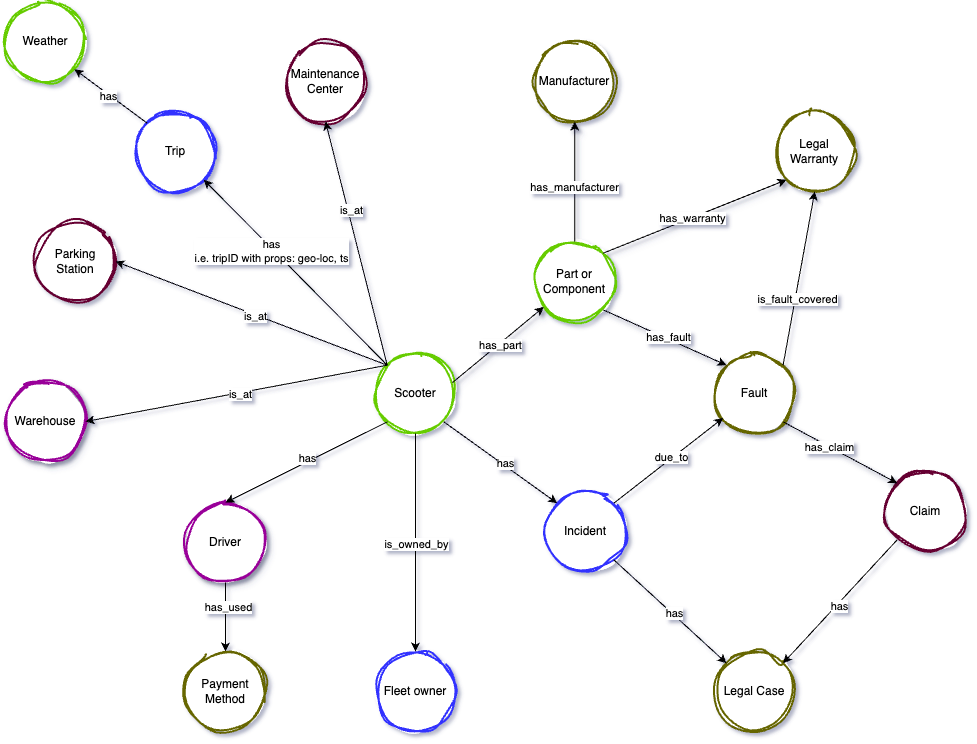

Since we’re planning to use Apache Gremlin to query our graph database, and we want to load our thousands of scooters generated by our Data Generator in bulk, Amazon Neptune will require the CSV data files with specific columns. To explain this through an example, let’s imagine the following:

Our monitoring system has just registered an incident from Driver 987a, while driving one of our scooters during heavy rain. The system has registered this incident, specifying this happened due an issue with the front tyre. We can also see that the driver has submitted a claim, which has to be reviewed by our legal department quickly. In our graph, this specific business event will be stored in the following way:

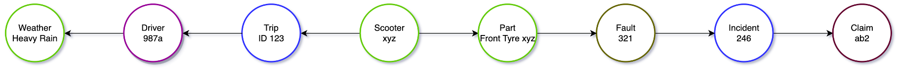

To bulk-load the data for this event into Amazon Neptune, related to the Claim AB2 from our customer Driver-987a, we would need 2 CSV files:

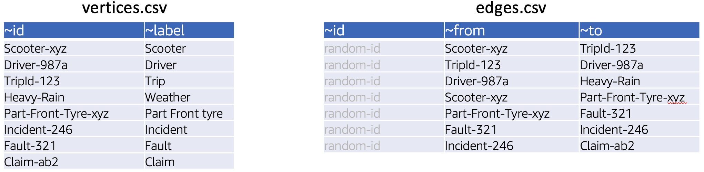

Tip: if you want to add only a few nodes and edges, you can use 

The first file called `vertices.csv` contains only nodes (also known as “vertices”). This file will need at least 2 pseudo-columns: “`~id`” and “`~label`”.  As you can see, labels is basically a the name of the vertex or node itself; e.g. scooter, driver, claim, etc. The ~id values have to be unique; these identifiers will be also used by our Edges files. 

The second file called `edges.csv` contains only edges. These are links between 2 nodes, using the columns named `from` and `to`. As you can see, the required column “`~from`” contains the initial start of the edge, similar to a simple path, and the column “`to`” indicates the final destination of such path; however, this edge can then be connected to another node, this to another one, so on and so forth  — similar to a directed acyclic graph or DAG —. But in the case of graphs, you can have bidirectional Edges, reversing the FROM and TO in a different line within the `edges.csv` file

As you can see, if we load these two CSV files, this would create a graph like the one we saw above (or here’s again)


Additional columns on any of these two files (nodes and edges) are treated as properties, by the Neptune bulk loader. For example, `Driver987a` could have a column called `Name` with the value `Carlos`; or the Edge connecting `Scooter-xyz` to `Trip-id-123` could have a property column called `distance_kilometers` with a numerical value being updated every 100 meters, using the scooter geo-location system.  In this case, the CSV data would look like this:

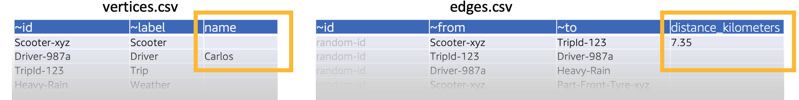

Note: Null values on properties (i.e. only Driver987a has a Name, or the other edges don’t have Distance) means simply that Neptune won’t add any “Name” or “Distance” properties to such nodes or edges. 

Now that you know what the Nodes and Edges files must contain, so Neptune can understand how to connect the nodes from your datasets, we can jump into our Data Generator. This is a simple mechanism to create and connect random scooters and parts, claims, etc, just as the one from the example above. 

If you want to know more about the Neptune formats, you can visit our [documentation here](https://docs.aws.amazon.com/neptune/latest/userguide/bulk-load-tutorial-format-gremlin.html).

## Scooters Data Generation

After understanding how our CSV data should look like for Neptune, let’s run our Data Generator.

1. As you can see in our `app.py`, there’s a class called “`ScootersDataStack`”. This contains a Python function, located at the `stack_lambda_datagen.lambda_function.py`, which is the one that will generate the data for us. 

We have a few options to run this Lambda function; i.e. from the AWS console or using the AWS CLI. Let’s use this second option. In a bash terminal, like in the one you’ve been using in VS Code to deploy the CDK stacks, run the following:

a. Get the Lambda function name from the output you may have copied from the CDK Deployment, or from the AWS console (CloudFormation — stack named “`ScootersDataStack`”, tab Outputs:

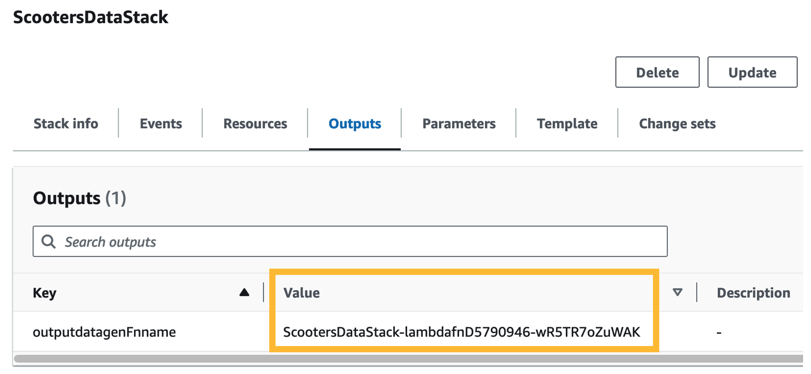

b. Now, let’s execute it from our VS Code terminal. Change the name of the function and the last parameter (`/tmp/lambda-exec.out`) of the “`aws lambda invoke`” command, to any place where you want to write the output; e.g. `C:\Users\carlos\temp\`

Note: remember to specify your region in the AWSCLI command below, e.g.` --region us-west-2`, if the profile is using a different region or there’s no default. 

```
$ aws lambda invoke --function-name ScootersDataStack-lambdafnD5790946-aBC5R7oZuWAK --profile profile-aws-dev-sandbox /tmp/lambda-exec.out

# Expected result:
{
    "StatusCode": 200,
    "ExecutedVersion": "$LATEST"
}

$ cat /tmp/lambda-exec.out

# Expected result:
{
  "statusCode": 200, 
  "body": "OK: Graph data generated at s3://scooterss3stack-scootersdemo5e399941-17bmwewec2uso/scooters-graph-demo/neptune/data, for 1000 scooters, each with 10 connected parts"
}
```

Unless you changed the number of scooters to generate (you can do this in the ), the function execution should take 2 to 3 seconds. As you can see in the output file (`/tmp/lambda-exec.out`), you now have generated the graph data in Amazon S3. This creates two CSV files: one file for nodes and another CSV for the edges to connect such vertices. Feel free to download both and have a look.

## Graph Exploration and Jupyter notebooks

Let’s now see a way to query and ingest our data into Amazon Neptune, from Jupyter notebooks!

1. Open your AWS console where you deployed the CDK stacks. Make sure you’re in the correct AWS region. Go to Amazon Neptune and then go to Notebooks (left panel). Click on the notebook created by our CDK stack; e.g. “`aws-neptune-buildOnAWSScootersNotebook`” and then click on Actions (top right button) and click on `Open JupyterLab`

If you have never worked with open source Jupyter notebooks, once you open JupyterLab, you can open and read the Jupyter notebook located at `/Neptune/01-Getting-Started/01-About-the-Neptune-Notebook.ipynb` or if you want to know a bit more, you can watch this [20-minute tutorial](https://www.youtube.com/watch?v=R1qVqAZfPes) for a quick introduction.

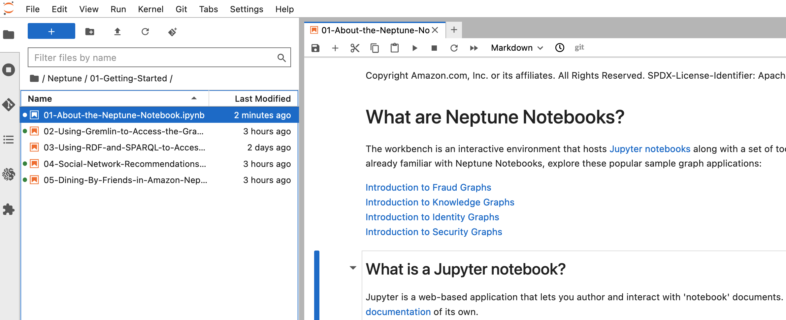

2. Once you are in the Jupyter environment, Neptune comes with some very useful notebooks. Just double click on the folder (left section) called Neptune. This will open a few folders with some Jupyter demo notebooks. Open the number 2, called 01-Getting-Started and then open (by double-clicking) the notebook called “`02-Using-Gremlin-to-Access-the-Graph`”. 

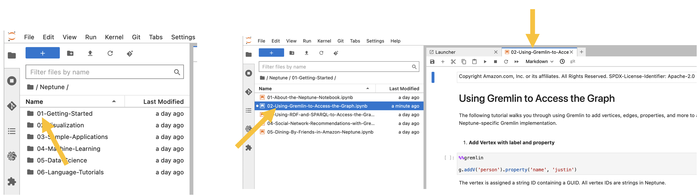


3. Read and run this notebook cell by cell, so you can learn about adding single nodes and connecting them with edges. 
    a. If you have never worked with Jupyter notebooks and you didn’t have time to watch the 2-minute tutorial from above, remember that a Jupyter notebook is composed by “cells” where you can write. These cells can be “code” or can be “markdown language”. For example, we’ll be using Python Kernels for our notebooks, which means that such “code” will be interpreted in such programming language. To execute these cells, simply enter Shift + Enter or hit the Play button.

For example:

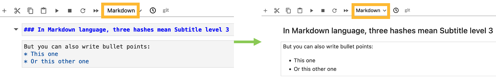

Optional: if you have time, I highly recommend you to open the folder `Neptune/02-Visualization` and then run the Jupyter lab called “`Air-Routes-Gremlin.ipynb`”. This is great to learn graphs in a different context than what we’re using in this series, so I highly recommend it. 

**Important**! If you want to keep learning, for example with this Airports dataset, I highly recommend you to visit [this tutorial (it’s a great and free book online, so you can go little by little)](https://kelvinlawrence.net/book/Gremlin-Graph-Guide.html), from our AWSome colleague Kelvin Lawrence.  

## Scooters Graph Data Loading & Querying

After generating our Scooters datasets using our Lambda function, let’s now load this data into Amazon Neptune.

1. If you’re not there already, go to the AWS Console, make sure the AWS region is the correct one, and open the Neptune notebook deployed by our CDK stack, in JupyterLab.

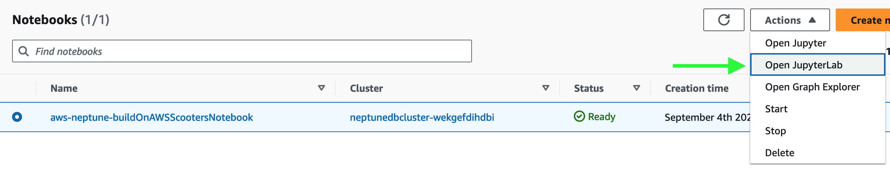

2. Once you’re in JupyterLab, enter into the Neptune folder and create a new folder for our lab; i.e. you can call it something like “99`-Scooters-Demo`”. In this new JupyterLab directory, you’ll upload the notebook we have prepared for you, from the git-cloned CDK folder called “`neptune_notebooks`”, under the file name “`Scooters-Demo-01.ipynb`”:

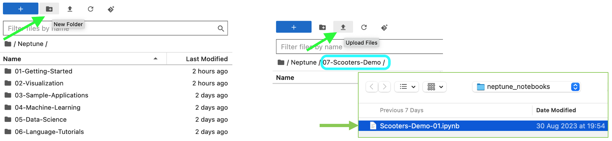

3. After loading this notebook from the git-cloned CDK project, double-click on the Scooters-Demo-01 notebook to open it in JupyterLab. Execute the first few cells, before you get until the following one from the next point (next image). These first cells you execute should return no errors. For example, in the `%status` execution the first line should say '`status': 'healthy'`.

4. Once you get into this cell below (image), follow the instructions from step 1 to 6. This is to change the values (change_me) to the real resources names; e.g. IAM roles or Neptune cluster deployed by our CDK stacks.

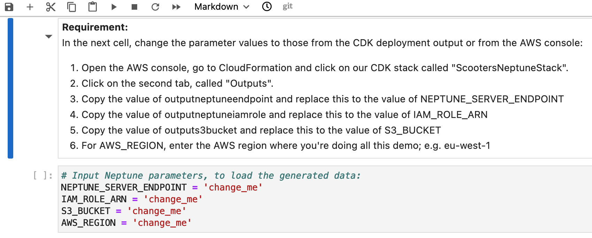

5. Carry on reading the instructions and comments in the notebook, before you execute each of the cells to load the data. These cells will load the Nodes and Edges for our Scooters dataset, and show you how to run a few business queries using Gremlin.

### Generative AI

In this new JupyterLab directory, you’ll upload a second notebook we have prepared for you, from the git-cloned CDK folder called “`neptune_notebooks`”, under the file name “`Scooters-Demo-02.ipynb`”.

Carry on reading the instructions and comments in the notebook, before you execute each of the cells to load the data. These cells call Amazon Bedrock, to be able to interact with Anthropic Claude model, so we can submit queries to the graph database using natural language.

Note: remember that, for a more-detailed explanation about each cell of such Jupyter notebook, we recommend you to go to our YouTube series for this project.

If you want to learn about Simplifying Graph Queries With LLMs and LangChain, I recommend you [to visit this video](https://www.youtube.com/watch?v=B7GtC1IeIUA) from our YouTube channel. In here, Kelvin Lawrence, graph architect and author of the fantastic online book “[Practical Gremlin](http://kelvinlawrence.net/book/Gremlin-Graph-Guide.html)”, will dive deep into this topic using a popular and public Airports graph dataset. 


## Third-party Visualization

For this series, we collaborated with Cambridge Intelligence to demonstrate the power of visual graph analysis built on AWS Neptune. Using their KeyLines graph visualization toolkit, we created an interactive visualization to explore a dataset based on a fictional scooter-sharing program.

If you'd like to build your own graph application, Cambridge Intelligence has a proven track record in enabling Neptune users to rapidly build insightful, interactive graph apps, with easy integration, rich visual analytics and an enjoyable developer experience. 

[Visit their website](https://cambridge-intelligence.com/neptune?utm_source=aws&utm_medium=blog) to start a free trial.


## Clean up resources

Follow the next steps to clean up (delete) all resources created by our stack. 

Note: if you created additional resources, such as EC2 instance, that may be using any of the Scooters’ CDK-deployed resources, the CDK Destroy command may fail due such dependencies. 

1. Via AWS CLI or the AWS console, empty the S3 bucket created by our CDK stack; e.g. `s3://`**`scooterss3stack-scootersdemo`**`XXXX/`. Otherwise, our CDK Removal Policy will not be able to delete the bucket.
2. Run the command below, to delete all resources deployed by our CDK project (architecture image above). This will ask if you want to delete those stacks; enter Y.

```
❯ cdk destroy --all --profile profile-aws-dev-sandbox
Are you sure you want to delete: ScootersNeptuneStack, ScootersDataStack, ScootersS3Stack, ScootersSsmParametersStack (y/n)? y
```

